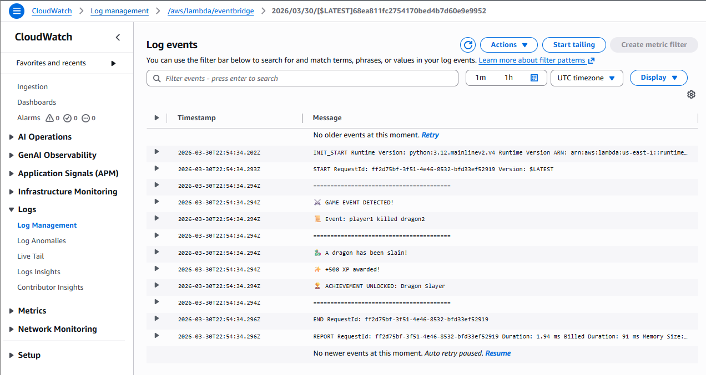
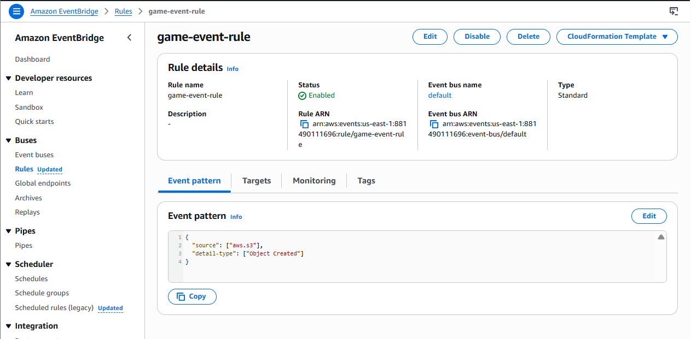
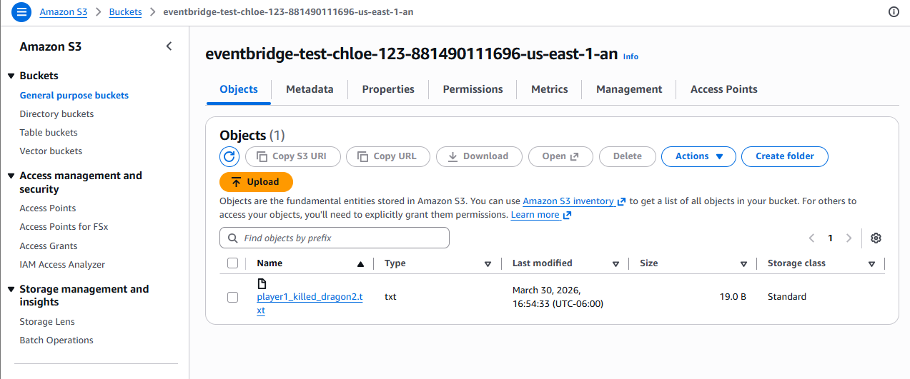

# Curiosity Report: Amazon EventBridge

## Why I Was Curious About Amazon EventBridge

My dad, Daniel Warner, is a software developer for the National Park Service. When I was visiting him, I got to sit in on a presentation from an AWS representative. They spent a lot of time talking about Amazon EventBridge. I didn't really understand what it was, why it was needed, or what its purpose was and I wanted to learn more. I wanted to actually figure out how it worked, so I decided to make it my curiosity report topic.

## What Is Amazon EventBridge?

Amazon EventBridge is a serverless event bus. That means it listens for things that happen which are called events and then it will automatically route them to other services, making it so then you do not have the manually trigger it. This allows for there to be more automatic processes and you do not need to manage the servers as much.

I learned that an event is just something that occurs. For example, a file being uploaded, a database being updated, or even just when a user is clicking buttons. EventBridge is the middleman, it directs where things go and basically says when THIS happens, do THAT.
 
The main components to Eventbridge are:
- Event Bus: which is a pipeline that receives and routes events
- Rules: which are filters that decide which events to act on and where it needs to send them
- Targets: which are the services that receive the event and then do something with it. For example, a Lambda function.

It can support events from AWS service, personal application along with 3rd party providers. Making it flexible for a lot of different users that would like to use it.

## Why It's Great

The biggest thing that stood out to me is that nothing has to be manually triggered. You set up the rule once and it will work automatically. Making it so in real time it will work every time the event happens. Allowing there to be less waiting or extra code needed to combine the services together. Along with this I learned that it will scale automatically, you can have 1 event fire or a bunch and it will handle it the same way.

## Challenges

At first learning about it was difficult but by taking it step by step and adding to what I already learned it became clearer what it was used for and helped me decide on how I wanted to test and implement this technology. When I was doing my experiment it was hard to figure out how to use it in AWS and exactly how to get started. During the experiment I had some problem with my file that took a while to figure out and then figuring out the right settings to make the event fire took some trial and error as well. I had to learn where everything in AWS was located and figure out how EventBridge connected to S3 and Lambda which took a little bit to figure out as well.

## Connection to the Course

While I have taken this course we have been working with CI pipelines where pushing the code to GitHub makes it so then it will automatically trigger a test run. EventBridge has the same idea as the CI pipeline. When something happens, something else will automatically be triggered or respond. The main difference between the two I think is that EventBridge works at the infrastructure level and not just at the code level. You could imagine using it in a pipeline to trigger tests or alerts when an artifact gets uploaded to S3.

## My Experiment

To actually understand EventBridge I built a small experiment I called the which is a game event logger. I am familiar with games and usually in games when something happens something else is triggered so it seemed fitting for my experiment. The idea that I came up with was to simulate a game where when I uploaded a file to the S3 it would represent a player action and then EventBridge would route that event to a Lambda function that would then respond. Kinda like a game announcer.

The architecture for it:
S3 (file upload) → EventBridge (rule) → Lambda (game announcer)

The steps that I took:
1. Created a Lamdba function called eventbridge-test.
2. Created a S3 bucket with the Eventbridge notifcations allowed.
3. Created an Eventbridge rule that I called game-event-rule that was listening for object created events from the S3 that would then target the Lambda function.
4. Uploaded files that were names things like player1_killed dragon.txt that would trigger the rule
5. The Lamda code read the filename and responded correctly

Results:
When I uploaded player1_killed_dragon2.txt, the Lambda fired in under 2ms and printed the full announcer sequence in CloudWatch logs. I was so excited when it worked after getting the issues fixed.

## What I Think

When I was first trying to understand the concept it sounded really complicated and like it would take a lot of different things to get it working but once I started diving deeper and experimenting the concepts finally started to click and I was able to understand what I needed to do. I understand why the AWS representative was spending so much time on it. It is really useful for cloud applications to talk to one another.

## Conclusion

Going into this I basically had no idea what EventBridge was, only a general idea. I had no idea why it existed or even how it worked. After researching and experimenting with the game event logger I now have an understanding of the core idea of EventBridge. It lets events flow between services automatically. It is a pretty clean and scalable way to connect cloud infrastructures together rather than manually connecting them together. It is something I find useful now and will continue to explore and most likely use in the future.