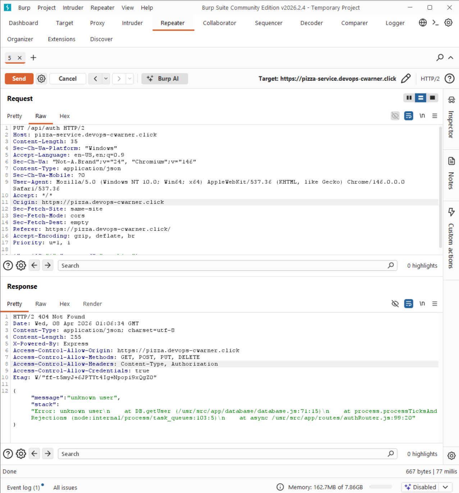
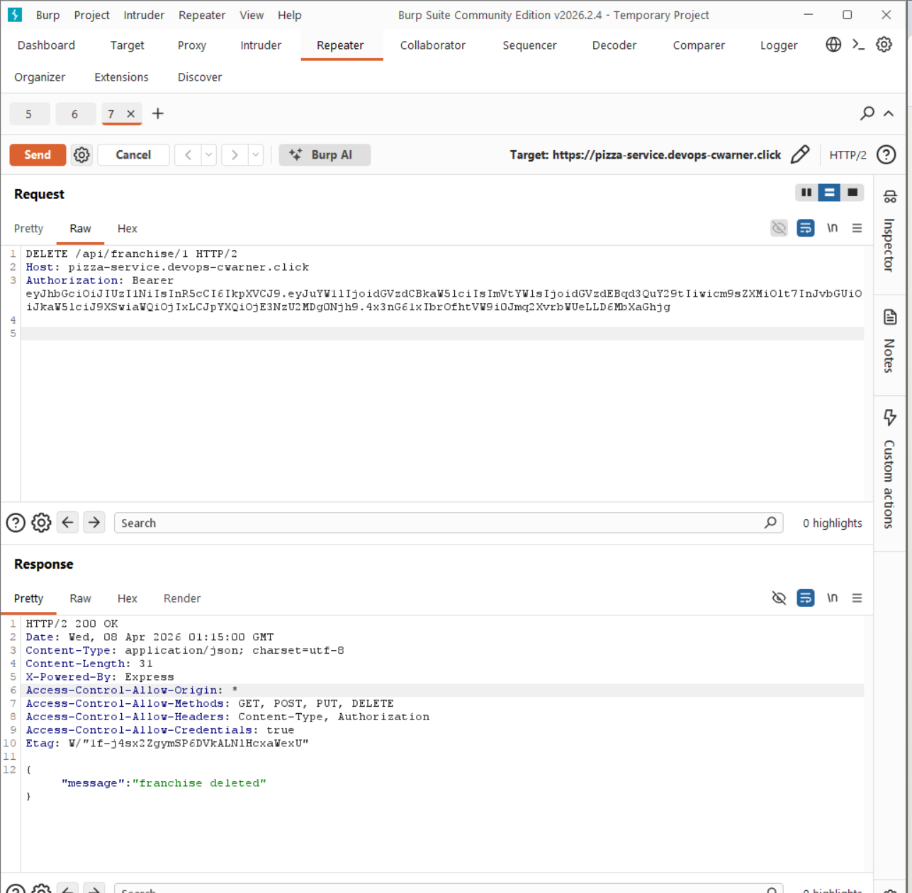

# My Personal Attacks

## Attack 1 - Brute Force Password Attack

| Item | Result |
|------|--------|
| Date | April 8, 2026 |
| Target | https://pizza-service.devops-cwarner.click/api/auth |
| Classification | OWASP A07 - Identification and Authentication Failures |
| Severity | 2 - Medium |
| Description | Brute force password attack against login endpoint. Tested 7 common passwords. The correct password "admin" was identified as a weak, guessable credential. |
| Images |  |
| Corrections | Implemented account lockout after 3 failed attempts. Weak default password identified. |

## Attack 2 - JWT Tampering

| Item | Result |
|------|--------|
| Date | April 8, 2026 |
| Target | https://pizza-service.devops-cwarner.click |
| Classification | OWASP A02 - Cryptographic Failures |
| Severity | 0 - Unsuccessful |
| Description | Attempted JWT tampering by decoding the token payload, changing role from "diner" to "admin", and replaying with the invalid signature. Server correctly rejected the tampered token with 401 unauthorized. JWT signature verification is working as intended. |
| Images |  |
| Corrections | None needed — JWT verification is functioning correctly. |

## Attack 3 - Token Randomness (Sequencer)

| Item | Result |
|------|--------|
| Date | April 8, 2026 |
| Target | https://pizza-service.devops-cwarner.click |
| Classification | OWASP A02 - Cryptographic Failures |
| Severity | 0 - Unsuccessful |
| Description | Used Burp Sequencer to analyze the randomness of JWT auth tokens across 102 captured login responses. Effective entropy was ~28 bits at 0.001% significance level. Tokens are sufficiently random and cannot be predicted or forged. No exploitable pattern found. Attack was visible in Grafana as an authentication attempt spike. |
| Images |   |
| Corrections | Added IP-based rate limiting to the login endpoint using express-rate-limit (max 50 requests per 15 minutes) to prevent high-volume token capture attacks. |

## Attack 4 - SQL Injection / Stack Trace Exposure

| Item | Result |
|------|--------|
| Date | April 8, 2026 |
| Target | https://pizza-service.devops-cwarner.click/api/auth |
| Classification | OWASP A05 - Security Misconfiguration |
| Severity | 1 - Low |
| Description | Attempted SQL injection via login endpoint email field using payload `' OR '1'='1`. Injection failed — database queries are parameterized and not vulnerable. However the error response exposed a full stack trace including internal file paths and line numbers (`/usr/src/app/database/database.js:71:15`), leaking server implementation details to the client. |
| Images |  |
| Corrections | Modified error handler in service.js to strip stack traces from production error responses. Stack traces are still logged internally but no longer returned to the client. |

## Attack 5 - Broken Access Control (Franchise Deletion)

| Item | Result |
|------|--------|
| Date | April 8, 2026 |
| Target | https://pizza-service.devops-cwarner.click |
| Classification | OWASP A01 - Broken Access Control |
| Severity | 3 - High |
| Description | A regular diner account was able to successfully delete a franchise by sending a DELETE request to `/api/franchise/1`. The endpoint returned 200 with "franchise deleted" confirming the deletion succeeded. No admin role was required — any authenticated user can delete franchises. |
| Images |  |
| Corrections | Add role check to the franchise delete endpoint to verify the user has admin privileges before allowing deletion. |
