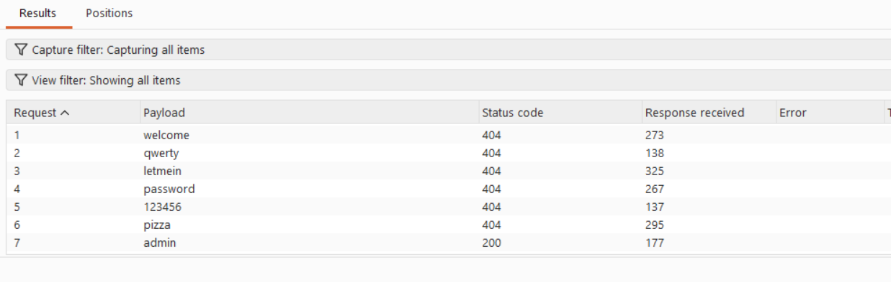
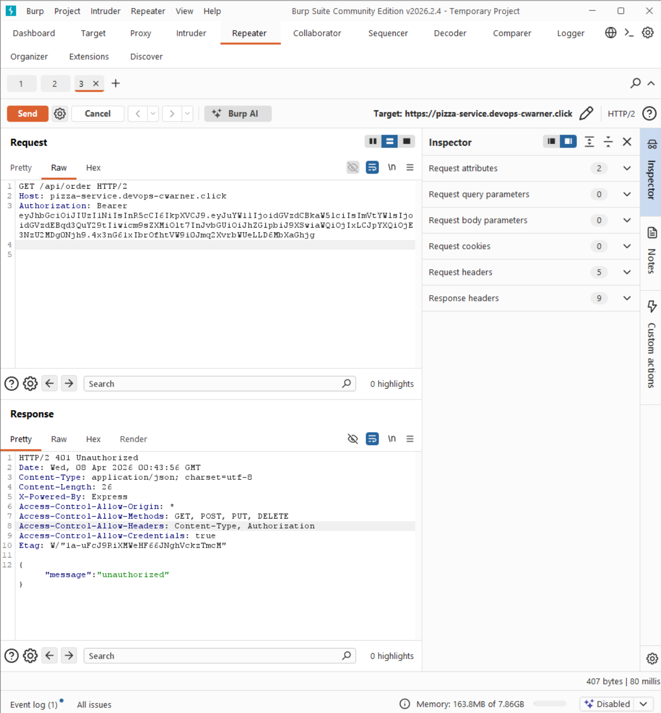
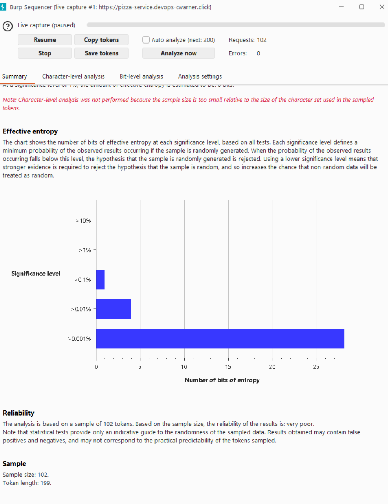
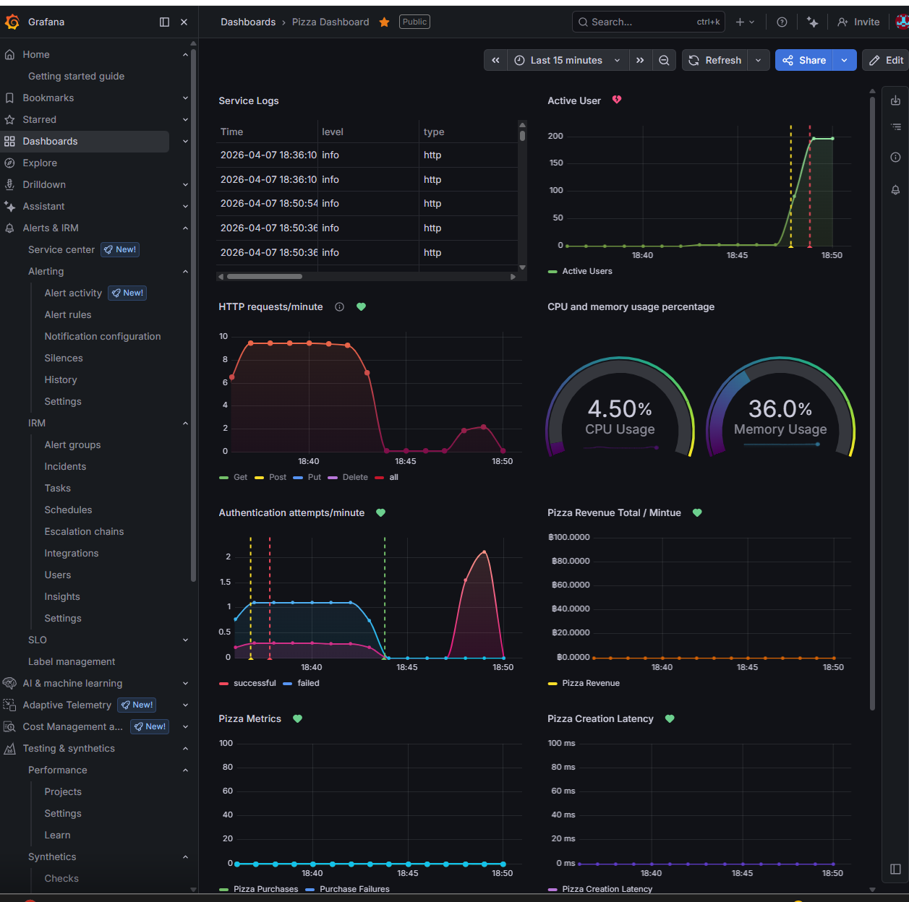

# My Personal Attacks

## Attack 1 - Brute Force Password Attack

| Item | Result |
|------|--------|
| Date | April 8, 2026 |
| Target | https://pizza-service.devops-cwarner.click/api/auth |
| Classification | OWASP A07 - Identification and Authentication Failures |
| Severity | 2 - Medium |
| Description | Brute force password attack against login endpoint. Tested 7 common passwords. The correct password "admin" was identified as a weak, guessable credential. |
| Images |  |
| Corrections | Implemented account lockout after 3 failed attempts. Weak default password identified. |

## Attack 2 - JWT Tampering

| Item | Result |
|------|--------|
| Date | April 8, 2026 |
| Target | https://pizza-service.devops-cwarner.click |
| Classification | OWASP A02 - Cryptographic Failures |
| Severity | 0 - Unsuccessful |
| Description | Attempted JWT tampering by decoding the token payload, changing role from "diner" to "admin", and replaying with the invalid signature. Server correctly rejected the tampered token with 401 unauthorized. JWT signature verification is working as intended. |
| Images |  |
| Corrections | None needed — JWT verification is functioning correctly. |

## Attack 3 - Token Randomness (Sequencer)

| Item | Result |
|------|--------|
| Date | April 8, 2026 |
| Target | https://pizza-service.devops-cwarner.click |
| Classification | OWASP A02 - Cryptographic Failures |
| Severity | 0 - Unsuccessful |
| Description | Used Burp Sequencer to analyze the randomness of JWT auth tokens across 102 captured login responses. Effective entropy was ~28 bits at 0.001% significance level. Tokens are sufficiently random and cannot be predicted or forged. No exploitable pattern found. Attack was visible in Grafana as an authentication attempt spike. |
| Images |   |
| Corrections | Added IP-based rate limiting to the login endpoint using express-rate-limit (max 50 requests per 15 minutes) to prevent high-volume token capture attacks. |