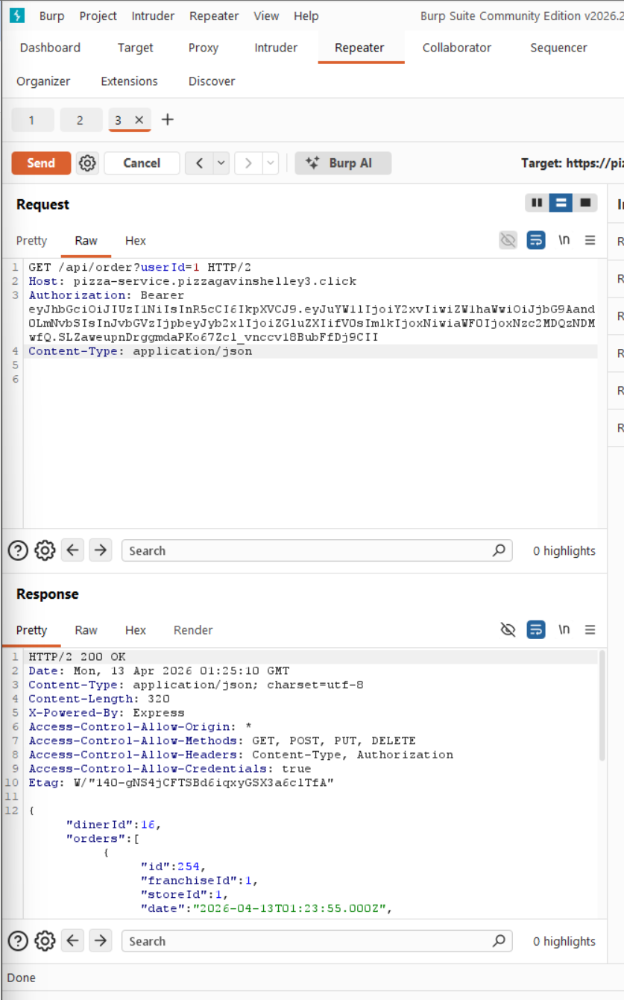
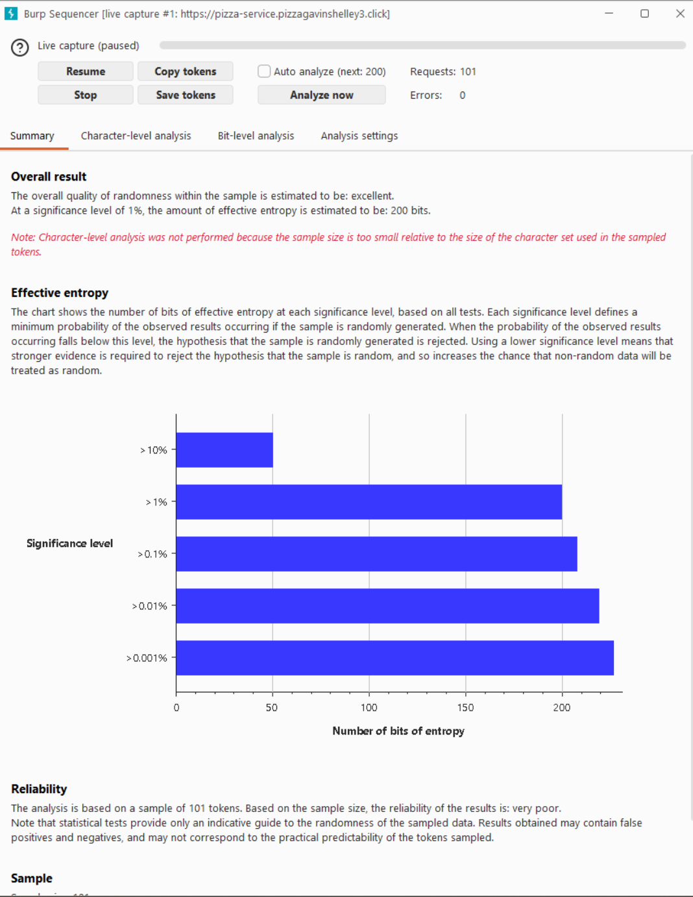

# My Personal Attacks

## Attack 1 - Brute Force Password Attack

Date: April 8, 2026
Target: https://pizza-service.devops-cwarner.click/api/auth
Classification: OWASP A07 - Identification and Authentication Failures
Severity: 2 - Medium
Description: Ran a brute force attack using Burp Intruder with 7 common passwords. "admin" came back with a 200 — turns out that was the actual password. Pretty easy win.
Images: 
Corrections: Set up account lockout after 3 failed attempts and changed the default password to something stronger.

## Attack 2 - JWT Tampering

Date: April 8, 2026
Target: https://pizza-service.devops-cwarner.click
Classification: OWASP A02 - Cryptographic Failures
Severity: 0 - Unsuccessful
Description: Grabbed a valid JWT, decoded it, flipped the role from "diner" to "admin", and sent it back. Got a 401 — the server caught the bad signature. Nothing to fix here.
Images: 
Corrections: None needed.

## Attack 3 - Token Randomness (Sequencer)

Date: April 8, 2026
Target: https://pizza-service.devops-cwarner.click
Classification: OWASP A02 - Cryptographic Failures
Severity: 0 - Unsuccessful
Description: Used Burp Sequencer to capture 102 tokens and check how random they were. Entropy came out to ~28 bits — random enough that you can't predict or forge them. The flood of login requests did spike in Grafana though, so I added rate limiting as a precaution.
Images:  
Corrections: Added rate limiting with express-rate-limit — max 50 requests per 15 minutes per IP.

## Attack 4 - SQL Injection / Stack Trace Exposure

Date: April 8, 2026
Target: https://pizza-service.devops-cwarner.click/api/auth
Classification: OWASP A05 - Security Misconfiguration
Severity: 1 - Low
Description: Tried `' OR '1'='1` in the email field. The injection itself didn't work — queries are parameterized. But the error response spat out a full stack trace with internal file paths and line numbers, which isn't great to be handing to an attacker.
Images: 
Corrections: Updated the error handler to strip stack traces from production responses. They still get logged server-side.

## Attack 5 - Broken Access Control (Franchise Deletion)

Date: April 8, 2026
Target: https://pizza-service.devops-cwarner.click
Classification: OWASP A01 - Broken Access Control
Severity: 3 - High
Description: Logged in as a regular diner and sent a DELETE to `/api/franchise/1`. Got back `{"message":"franchise deleted"}` — it actually worked. No admin check on that endpoint at all.
Images: 
Corrections: Need to add an admin role check to the franchise delete endpoint.

# Partner Attacks

## Attack 1 — Brute Force Password Attack

Date: April 12, 2026
Target: https://pizza.pizzagavinshelley3.click
Classification: OWASP A07 - Identification and Authentication Failures
Severity: 0 - Unsuccessful
Description: Threw 30+ passwords at his login endpoint using Burp Intruder — common ones, name variations, BYU stuff, food-themed guesses. Nothing hit. No weak credentials on this one.
Images: 
Corrections: N/A

## Attack 2 — Broken Access Control (Franchise Deletion)

Date: April 12, 2026
Target: https://pizza-service.pizzagavinshelley3.click
Classification: OWASP A01 - Broken Access Control
Severity: 3 - High
Description: Same attack I found on my own site. Logged in as a diner, grabbed my JWT, and sent DELETE to `/api/franchise/14`. Got back `{"message":"franchise deleted"}`. The endpoint doesn't check if you're an admin before letting you delete.
Images: 
Corrections: N/A — Gavin's site to fix.

## Attack 3 — Input Sanitization / Injection

Date: April 12, 2026
Target: https://pizza-service.pizzagavinshelley3.click/api/auth
Classification: OWASP A03 - Injection
Severity: 1 - Low
Description: Sent `' OR '1'='1` as the email on the registration endpoint. Didn't bypass anything, but the server just accepted it and created an account with that string as the email. No validation on the email field at all.
Images: 
Corrections: N/A — Gavin's site to fix.

## Attack 4 — IDOR (Insecure Direct Object Reference)

Date: April 12, 2026
Target: https://pizza-service.pizzagavinshelley3.click/api/order
Classification: OWASP A01 - Broken Access Control
Severity: 0 - Unsuccessful
Description: Tried pulling other users' orders by adding `?userId=1` to the GET `/api/order` request. Server just ignored it and returned my own orders. This one's locked down.
Images: 
Corrections: N/A

## Attack 5 — Token Randomness (Sequencer)

Date: April 12, 2026
Target: https://pizza-service.pizzagavinshelley3.click
Classification: OWASP A02 - Cryptographic Failures
Severity: 0 - Unsuccessful
Description: Captured 101 tokens using Burp Sequencer and analyzed the entropy. Came back at 200 bits, rated "excellent." Tokens are completely random — no way to predict or forge them.
Images: 
Corrections: N/A